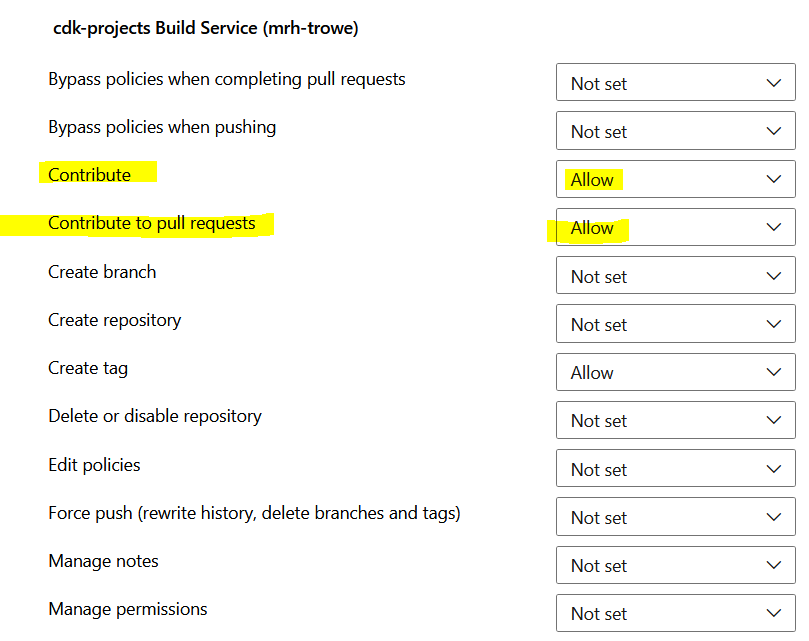
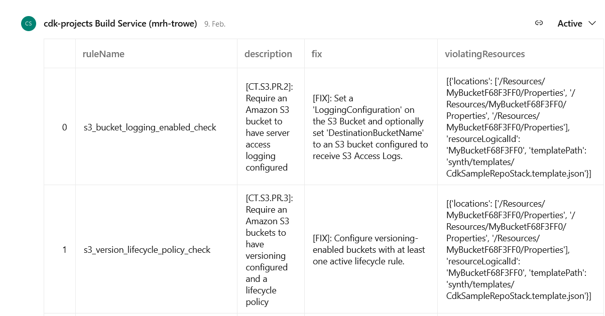

# Pull Request Reporting with CDK-Validator and Azure DevOps

## TLDR;

The `cdk-validator-cfnguard` extension can be used to prevent future findings within AWS services such as `Security Hub` or `Trusted Advisor`. This refers to findings such as subnets that assign automatically public IPs in public subnets or that have API gateways logging activated and many more. In short, it's about a lot of good practices about AWS. The package can be easily installed with your CDK app and with CICD systems such as Azure Dev Ops you can create meaningful reports in the pull request. This enables a transparent view of the code changes to build AWS infrastructure. Four caveats must be mentioned. First, ARM-based build servers are not yet supported. Second, the package does not support metadata to avoid false positives. Third, very large CDK apps might fail due to character limit. Fourth, it's still experimental. Nevertheless, the tool is a good alternative to Checkov or Stelligent.

## Shifting Your Cloud Security to the Left

AWS services are subject to constant change. This applies not only to their properties, but also to the models in which they should be used. For the AWS customer, this results in the problem of keeping up or making good decisions not to do so. Infrastructure that has already been deployed can be examined using various tools. Prowler is one of them, but AWS also offers several services for this purpose. The most strategically important is certainly the Security Hub service. Various findings from many other services are aggregated here, which can affect both the infrastructure (e.g. AWS Config) and the software (e.g. AWS Inspector).

If you now use these services to fix the infrastructure findings, a drift occurs that is not always easy to fix. It is better to check for possible problems before the actual deployment. This approach is called “Shift-Left”. This can be done with the package [cdk-validator-cfnguard](https://github.com/cdklabs/cdk-validator-cfnguard). It's based on the [CloudFormation Guard package](https://github.com/aws-cloudformation/cloudformation-guard).

After adding the packet, `cdk synth` command checks the current deployment against all rules by the AWS Control Tower. A file (`./cdk.out/policy-validation-report.json`) is created that provides information about policy violations.

## Implementation in your CDK-App

The example of this app deploys an S3 bucket. This one should be safe. We will use encryption with KMS, a bucket policy that requires TLS and block public. Versioning should be enabled, to create some kind of deletion protection.

```Python
# ./cdk-validator/cdk_validator/cdk_validator_stack.py

from aws_cdk import Stack, aws_s3 as s3
from constructs import Construct


class CdkValidatorStack(Stack):
    """Create the actual deployment in each AWS account.

    Args:
        Stage (Stage): cdk Class stage
    """
    def __init__(
        self,
        scope: Construct,
        construct_id: str,
        **kwargs
    ) -> None:
        """Initialise CDK stack class."""
        super().__init__(scope, construct_id, **kwargs)
        """Create the actual CloudFormation stack."""
        s3.Bucket(
            self,
            id="MyBucket",
            block_public_access=s3.BlockPublicAccess(
                block_public_acls=True,
                block_public_policy=True,
                ignore_public_acls=True,
                restrict_public_buckets=True,
            ),
            versioned=True,
            enforce_ssl=True,
            encryption=s3.BucketEncryption.KMS_MANAGED,
        )
```

### Installation in Your CDK App

For installation, we need to add the following packages to our Python project virtual environment.

```txt
# requirements.txt
aws-cdk-lib==2.118.0
constructs>=10.0.0,<11.0.0
cdklabs.cdk-validator-cfnguard
requests
pandas
pyarrow
```

In addition to `cdk-validator-cfnguard`, we also use `pandas` and `pyarrow` to easily convert JSON into Markdown which helps to gain clearer Pull Request comments. To install these libraries run `pip install -r requirements.txt`.

In the `app.py` we have to import the `cdk-validator-cfnguard` library and initialize the `class CdkSampleRepo(App)` with it.

```Python
# app.py

#!/usr/bin/env python3
from aws_cdk import App, Environment
from cdk_validator.cdk_validator_stack import CdkValidatorStack
from cdklabs import cdk_validator_cfnguard as cfn_guard


class CdkSampleRepo(App):
    """Create the CDK App for network management.

    Args:
        App (aws_cdk.App): CDK App class
    """
    def __init__(self, *args, **kwargs):
        """Initialise this ensemble class."""
        super().__init__(*args, **kwargs)
        """Create the actual CloudFormation stack tree."""
        self.default_env = Environment(
            account="12345678910",
            region="eu-central-1",
        )
        self.list_of_stacks = []

    def create_cfn_stacks(self):
        """Create CFN stacks."""
        zpa_stack = CdkValidatorStack(
            self,
            construct_id="CdkValidatorStack",
            stack_name=f"my-bucket-sample-stack",
        )
        self.list_of_stacks.append(zpa_stack)

if __name__ == "__main__":
    app = CdkSampleRepo(
        policy_validation_beta1=[
            cfn_guard.CfnGuardValidator(control_tower_rules_enabled=True)
        ]
    )
    app.create_cfn_stacks()
    app.synth()

```

Finally, the `cdk.json` need to be extended by this key-value pair to store the report `cdk.out`.

```JSON
# cdk.json
# Snippet
{
  "app": "python3 app.py",
  # ...
  "context": {
    # ...
    "@aws-cdk/core:validationReportJson": true
  }
}

```

From this moment on, the evaluation of the deployment against the `Control Tower rules` is started with every `cdk synth` CLI command.

### Pull Request Reporting: Integrating Azure DevOps API

After a `cdk synth` has been successfully completed, the report can be found here: `./cdk.out/policy-validation-report.json`. To make this visible for the pull request, we have to send it to the Azure DevOps API. To use the API, I use the following class, which creates `class Message`.
It uses only environment variables with which are present in pipeline. With `def add()` we can send data to the API.

```Python
# ./src/pull_request/pull_request_Comment.py

class Message:
    """Instance of a message."""

    def __init__(self):
        """Init message class."""
        SYSTEM_COLLECTIONURI = os.getenv("SYSTEM_COLLECTIONURI")
        SYSTEM_PULLREQUEST_PULLREQUESTID = os.getenv("SYSTEM_PULLREQUEST_PULLREQUESTID")
        SYSTEM_TEAMPROJECT = os.getenv("SYSTEM_TEAMPROJECT")
        BUILD_REPOSITORY_ID = os.getenv("BUILD_REPOSITORY_ID")
        self.url = (
            f"{SYSTEM_COLLECTIONURI}{SYSTEM_TEAMPROJECT}/_apis/git/repositories/"
            f"{BUILD_REPOSITORY_ID}/pullRequests/{SYSTEM_PULLREQUEST_PULLREQUESTID}"
            "/threads?api-version=7.0"
        )
        self.headers = {
            "content-type": "application/json",
            "Authorization": f"BEARER {os.getenv('SYSTEM_ACCESSTOKEN')}",
        }

    def add(self, comment: str) -> bool:
        """Add a message to Azure DevOps Pull Request."""
        data = {
            "comments": [{"parentCommentId": 1, "content": comment, "commentType": 1}],
            "status": 1,
        }
        logging.info(f"Sending PR comment to this url: {self.url}")
        r = requests.post(url=self.url, json=data, headers=self.headers)

        logging.info(r.status_code)
        logging.info(r.reason)

        if r.status_code == 200:
            return True
        else:
            return False
```

The permissions for communication are set for the **Build Service**. We need to allow general contribution and contribution to Pull Requests.



Now we can communicate with the API, a process needs to read the report file. Also, we need to filter on relevant parts and read a readable table object. This is done with `comment.py`.

```Python
# ./src/pull_requests/comment.py
# Snippet

def main():
    """Create a Pull Request comment within azure-pipelines-pr.yml"."""
    msg = pull_request_comment.Message()

    try:
        with open("./cdk.out/policy-validation-report.json", "r") as report:
            report_dict = json.load(report)
        df = pd.DataFrame.from_dict(report_dict["pluginReports"][0]["violations"])
        df = df.drop(["violatingConstructs", "ruleMetadata"], axis=1)
    except IndexError as e:
        logging.exception(e)
        logging.exception(report_dict)
        df = pd.DataFrame.from_dict([{"ValdidationErrors": "None"}])
        
    logging.info("Adding CDK Validation report")
    msg.add(comment=df.to_markdown())
```

Information under key **violations** is really interesting (report_dict["pluginReports"][0]["violations"]). Following this part, the dict is very structured and can easily be read in as `pandas.Dataframe()`.

Sometimes our deployment is error-free. Its' lucky situation, but the script then needs to catch an IndexError on `df.drop(["violatingConstructs", "ruleMetadata"], axis=1)`. In order to get the clean Markdown table, we set a value ourselves or take the findings via `msg.add(comment=df.to_markdown())` and send the content to the API.

### CICD Definition: Create Report within Pull Requests

The following `azure-pipeline.yaml` shows a simple solution to integrate the discussed scripts above:

```YAML
# azure-pipelines.yaml
# Snippet

stages:
- stage: RunningCDKSynthesize
  displayName: CIStage-Creation
  jobs:
  - job: IaCCreationValidation
    steps:
    - template: azure-pipelines-common.yml
    - task: AWSShellScript@1
      inputs:
        awsCredentials: ${{ parameters.ServiceConnection }}
        regionName: ${{ parameters.AwsRegion }}
        scriptType: 'inline'
        inlineScript: |
          cd $(Build.Repository.Name)
          cdk synth
          python3 src/pull_requests/comment.py
      displayName: 'Validating AWS CDK output and Creating Pull Request comment'
    
```

The result in Azure DevOps looks like this:



We still have chance for improvments as you can see.

## Summary

The blog post showed how you can set up Pull Request reporting with the CDK, cdk-validator-guard and Azure DevOps. Of course, Azure DevOps can be replaced by any other CICD systems. With this approach, incorrect configurations become quickly visible and can also lead to the CICD aborting (for example with cfn-lint or cfn_nag).

Four caveats must be mentioned, as I faced all. So far, ARM-based build servers are not yet supported. I already created and [issue](https://github.com/cdklabs/cdk-validator-cfnguard/issues/101) on that. Second, the package does not [support metadata](https://github.com/cdklabs/cdk-validator-cfnguard/issues/202) to avoid false positives. This would enables as explain design decision via code. Very useful in situation where your software needs a configuration which, is violation certain AWS best practices. Third, very large CDK apps might fail due to character limit. I have a network deployment with more than ten stacks. As you can image, the [report will become bigger](https://github.com/cdklabs/cdk-validator-cfnguard/issues/154) and bigger by adding more stacks. Fourth, it's still experimental, which might lead to breaking changes in future. Nevertheless, the tool is a good alternative to Checkov or Stelligent.
